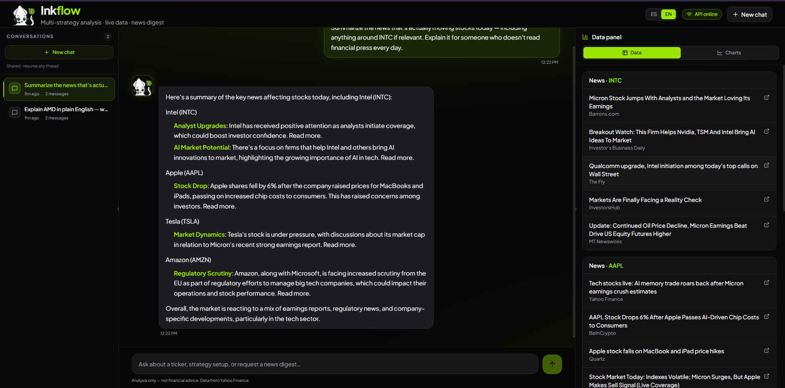

# Inkflow Frontend

<p align="center">
  
</p>

<p align="center">
  <strong>Copiloto de mercado multi-estrategia</strong><br/>
  Interfaz conversacional para análisis bursátil con datos en vivo y panel de insights.
</p>

<p align="center">
  
</p>

---

## La idea

Inkflow une chat con IA y datos de mercado en una sola pantalla: el usuario pregunta, IGO responde y el panel lateral muestra snapshots, noticias y escaneos sin perder contexto.

Diseñado para sentirse como producto real — no como demo técnica.

## Qué incluye

- Chat con continuidad por conversación
- Panel de datos con artifacts (snapshot, news digest, strategy scan)
- Sidebar de hilos y chips de sugerencias dinámicas
- Gráficos contextuales y embeds de TradingView
- Interfaz bilingüe (`es` / `en`)

## Stack

- React 19 + TypeScript
- Vite
- Tailwind CSS

## Scripts

```bash
npm install
npm run dev
npm run build
npm run preview
npm run lint
```

## Enlaces

- Repositorio frontend: [TheNasky/Inkflow-Frontend](https://github.com/TheNasky/Inkflow-Frontend)
- Deploy frontend: [Inkflow-loligo.vercel.app](inkflow-loligo.vercel.app/)
- Repositorio backend: [TheNasky/Loligo-Backend-Challenge](https://github.com/TheNasky/Loligo-Backend-Challenge)
- Deploy backend: `<BACKEND_DEPLOY_URL>`
